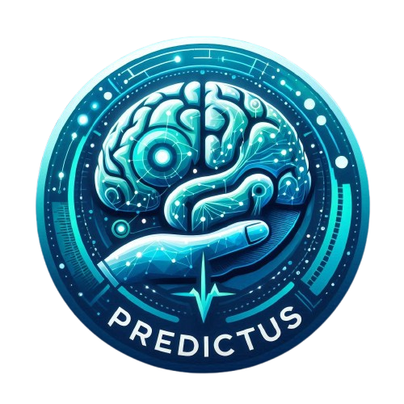

<p align="center">
  
</p>

# Data Science Proyecto - Grupo 3
## Predictus: Inteligencia Artificial para la Detección del Riesgo de Ictus

Predictus es una aplicación web innovadora que utiliza inteligencia artificial para evaluar el riesgo de ictus a través del análisis automatizado de indicadores de salud. Los estudios muestran que hasta un 90% de los ictus podrían prevenirse con las medidas adecuadas. La educación y concienciación sobre el ictus, junto con el acceso a herramientas de evaluación, son pasos clave para empoderar a los pacientes y fomentar la prevención.

En este contexto, **Predictus** proporciona una solución integral. Desarrollada con **Streamlit**, nuestra aplicación analiza los datos de salud de los pacientes mediante modelos avanzados, como **XGBoost** y redes neuronales, para detectar factores de riesgo de ictus de manera automatizada. Incluye también un modelo de redes neuronales convolucionales diseñado específicamente para detectar ictus en imágenes en cuestión de segundos, brindando un soporte adicional en el diagnóstico temprano.

<div style="text-align: center;">
  <a href="https://www.canva.com/design/DAGULhwfx50/m4lB0cxJSt169PW5N46-sw/edit?utm_content=DAGULhwfx50&utm_campaign=designshare&utm_medium=link2&utm_source=sharebutton" style="display: inline-block; padding: 10px 20px; font-size: 16px; color: white; background-color: #007bff; border-radius: 5px; text-decoration: none;">Acceder a la presentación</a>
</div>

---

## Tecnologías Utilizadas

Este proyecto requiere un entorno que soporte las siguientes tecnologías:

- **Python** 
- **TensorFlow/Keras** 
- **Scikit-learn**
- **Optuna** 
- **Docker** y **Docker-Compose** 
- **MLflow** 
- **VS Code** y **GitHub** 
  
---
## Plazos

- **Entrega Final**: 28 de Octubre de 2024

---

## Equipo del Proyecto

- **Scrum Master**: Andrea Moraleda Blanco

- **Product Owner (PO)**: Iryna Bilokon

- **Desarrolladores**:
  - Alberto Carillo 
  - Lisy Velasco

---

## How to Use

Para ejecutar el proyecto localmente, sigue los pasos a continuación:

### 1. Clonar el repositorio

```bash
git clone https://github.com/AI-School-F5-P3/DS_Grupo3.git
```

### 2. Descargar el modelo de reconocimiento de imágenes
Descarga el modelo preentrenado de reconocimiento de imágenes desde el siguiente enlace y guárdalo como `nn_stroke_img.keras`:

- [Descargar el modelo](https://drive.google.com/file/d/1-1kK4Q7YAHsJlnbLlEQXfqYnO1A7Qcxl/view?usp=drive_link)

### 3. Añadir el modelo en el directorio `src/model`
Coloca el archivo descargado `nn_stroke_img.keras` en el directorio `src/model` de tu proyecto. Asegúrate de que la estructura del directorio sea la correcta.

### 4. Ejecutar el contenedor Docker
Para iniciar el entorno Docker, asegúrate de estar en el directorio raíz del proyecto y ejecuta el siguiente comando:

```bash
docker-compose up --build
```
